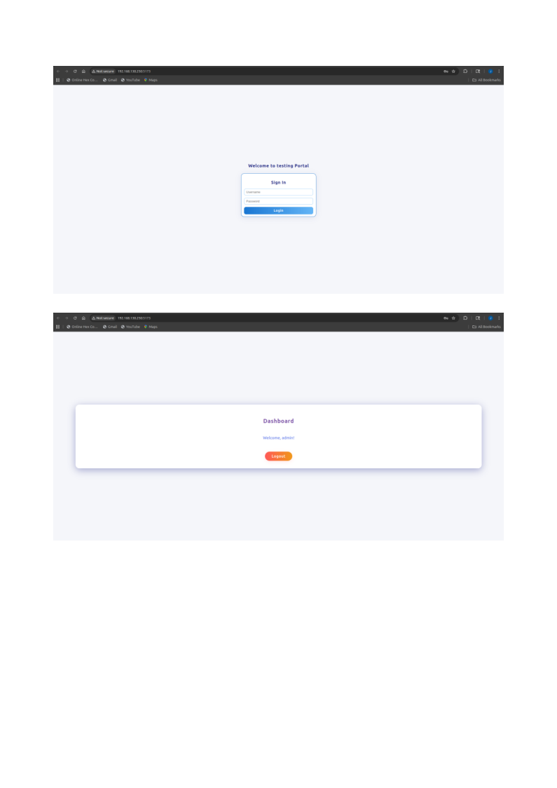

# Django + React CRUD Boilerplate

A modern, production-ready boilerplate for building full-stack CRUD applications with Django (backend) and React (frontend). This template features robust automation scripts for rapid project setup, seamless LAN development, and process management. With best practices for security, testing, and developer experience, it’s ideal for both prototyping and scaling real-world web services.

## Features

- Django backend with Django REST Framework
- React frontend (Vite)
- SQLite database (default, easily swappable)
- Health check endpoint
- Ready for rapid CRUD development

## Project Structure

```bash
backend/         # Django project and API
  └── data/      # SQLite database
  └── django_folder/  # Django settings, views, etc.
frontend/
  └── react_interface/ # React app (Vite)
```

## Quick Start (Recommended)



---

To get your project up and running, simply use the automation scripts below. They handle all setup, configuration, and server management for you—no manual steps required!

The rest of this README provides additional development details and inside information for customizing or extending the project.

---

## Project Automation Scripts

This project includes automation scripts to simplify setup and server management:

- **setup_project.sh**: Interactive project customizer and setup script. Use this to rename the project, set author info, configure LAN access, install dependencies, and optionally start servers. Run from the project root:

  ```bash
  ./setup_project.sh
  ```

- **start_servers.sh**: Starts the Django backend and React frontend servers on their default ports (8000 and 5173) in the background, if the ports are available. Creates PID and log files for each server. Run from the project root:

  ```bash
  ./start_servers.sh
  ```

- **stop_servers.sh**: Stops the Django and React servers using their PID files (if present) and force-kills any process using ports 8000 or 5173. Run from the project root:

  ```bash
  ./stop_servers.sh
  ```

These scripts provide colorized output and robust process management. See script comments for details.

---

## FAQ / Troubleshooting

**Q: The server won't start, or port is in use.**
A: Use `./stop_servers.sh` to free ports 8000/5173, then try again.

**Q: How do I change the default admin credentials?**
A: Log in to Django admin at `/admin/` and change the password, or run `poetry run python manage.py changepassword admin`.

**Q: How do I connect the frontend to a different backend?**
A: Edit `frontend/react_interface/.env` and set `VITE_API_URL` to your backend URL.

**Q: Where are logs and PID files?**
A: In the project root: `backend_django.log`, `frontend_react.log`, `backend_django.pid`, `frontend_react.pid`.

---

## Feedback & Contributions

Pull requests are welcome! See CONTRIBUTING.md for guidelines.

---

## Security & Environment

- **Never commit secrets or credentials.**
- The `.env` file is used for frontend config and should be kept out of version control.
- `.env` is included in `.gitignore` by default.

**Do not use default admin credentials in production.** Always create your own superuser.

---

---

## Setup Instructions

### Backend

1. **Install dependencies:**

   ```bash
   cd backend
   poetry install
   ```

2. **Run migrations:**

   ```bash
   poetry run python manage.py migrate
   ```

3. **Create a superuser:**

   ```bash
   poetry run python manage.py createsuperuser
   ```

4. **Start the server:**

   ```bash
   poetry run python manage.py runserver
   ```

5. **Health check:**
   Visit [http://localhost:8000/health/](http://localhost:8000/health/)

### Frontend

1. **Install dependencies:**

   ```bash
   cd frontend/react_interface
   npm install
   ```

2. **Start the React app:**

   ```bash
   npm run dev
   ```

3. **Visit:**
   [http://localhost:5173/](http://localhost:5173/) (default Vite port)

## Testing

This project includes a minimal backend test suite. To run tests:

```bash
cd backend
poetry run python manage.py test
```

---

## ASGI Deployment

To run Django with an ASGI server (for WebSockets or async support), use Daphne or Uvicorn:

### Example with Uvicorn

```bash
cd backend
poetry run uvicorn django_folder.asgi:application --host 0.0.0.0 --port 8000
```

### Example with Daphne

```bash
cd backend
poetry run daphne django_folder.asgi:application
```

See the [Django ASGI docs](https://docs.djangoproject.com/en/5.2/howto/deployment/asgi/) for more details.

## API Usage

- Authenticate via `/api/login/`
- Use `/api/logout/` to log out
- Add your CRUD endpoints in Django as needed

## Security Note

**Do not use default admin credentials in production.**
Always create your own superuser.

## Customization

- Change app names, endpoints, and branding as needed.
- Update CORS settings in `backend/django_folder/settings.py` for your frontend URL.
- Replace or extend authentication logic as required.

## Contributing

Pull requests are welcome! Please open an issue first to discuss changes.

## License

MIT or your preferred license.

---
This boilerplate is ready for rapid prototyping and can be extended for production use.
